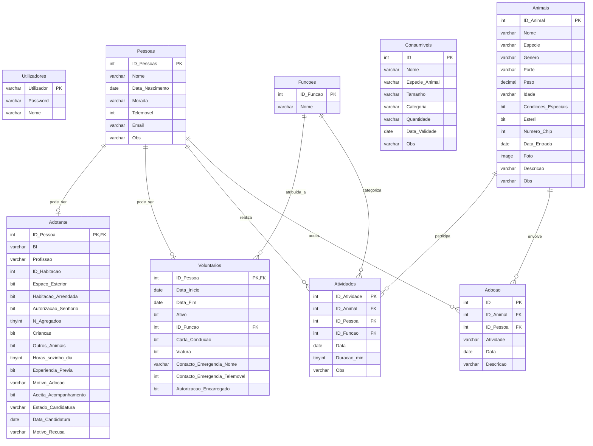

```mermaid
erDiagram
    Utilizadores {
        varchar Utilizador PK
        varchar Password
        varchar Nome
    }

    Pessoas {
        int ID_Pessoas PK
        varchar Nome
        date Data_Nascimento
        varchar Morada
        int Telemovel
        varchar Email
        varchar Obs
    }

    Adotante {
        int ID_Pessoa PK, FK
        varchar BI
        varchar Profissao
        int ID_Habitacao
        bit Espaco_Esterior
        bit Habitacao_Arrendada
        bit Autorizacao_Senhorio
        tinyint N_Agregados
        bit Criancas
        bit Outros_Animais
        tinyint Horas_sozinho_dia
        bit Experiencia_Previa
        varchar Motivo_Adocao
        bit Aceita_Acompanhamento
        varchar Estado_Candidatura
        date Data_Candidatura
        varchar Motivo_Recusa
    }

    Voluntarios {
        int ID_Pessoa PK, FK
        date Data_Inicio
        date Data_Fim
        bit Ativo
        int ID_Funcao FK
        bit Carta_Conducao
        bit Viatura
        varchar Contacto_Emergencia_Nome
        int Contacto_Emergencia_Telemovel
        bit Autorizacao_Encarregado
    }

    Animais {
        int ID_Animal PK
        varchar Nome
        varchar Especie
        varchar Genero
        varchar Porte
        decimal Peso
        varchar Idade
        bit Condicoes_Especiais
        bit Esteril
        int Numero_Chip
        date Data_Entrada
        image Foto
        varchar Descricao
        varchar Obs
    }

    Consumiveis {
        int ID PK
        varchar Nome
        varchar Especie_Animal
        varchar Tamanho
        varchar Categoria
        varchar Quantidade
        date Data_Validade
        varchar Obs
    }

    Funcoes {
        int ID_Funcao PK
        varchar Nome
    }

    Atividades {
        int ID_Atividade PK
        int ID_Animal FK
        int ID_Pessoa FK
        int ID_Funcao FK
        date Data
        tinyint Duracao_min
        varchar Obs
    }

    Adocao {
        int ID PK
        int ID_Animal FK
        int ID_Pessoa FK
        varchar Atividade
        date Data
        varchar Descricao
    }

    %% Relações e Chaves Estrangeiras
    Pessoas ||--o| Adotante : "pode_ser"
    Pessoas ||--o| Voluntarios : "pode_ser"
    Funcoes ||--o{ Voluntarios : "atribuida_a"
    
    Animais ||--o{ Atividades : "participa"
    Pessoas ||--o{ Atividades : "realiza"
    Funcoes ||--o{ Atividades : "categoriza"

    Animais ||--o{ Adocao : "envolve"
    Pessoas ||--o{ Adocao : "adota"
```